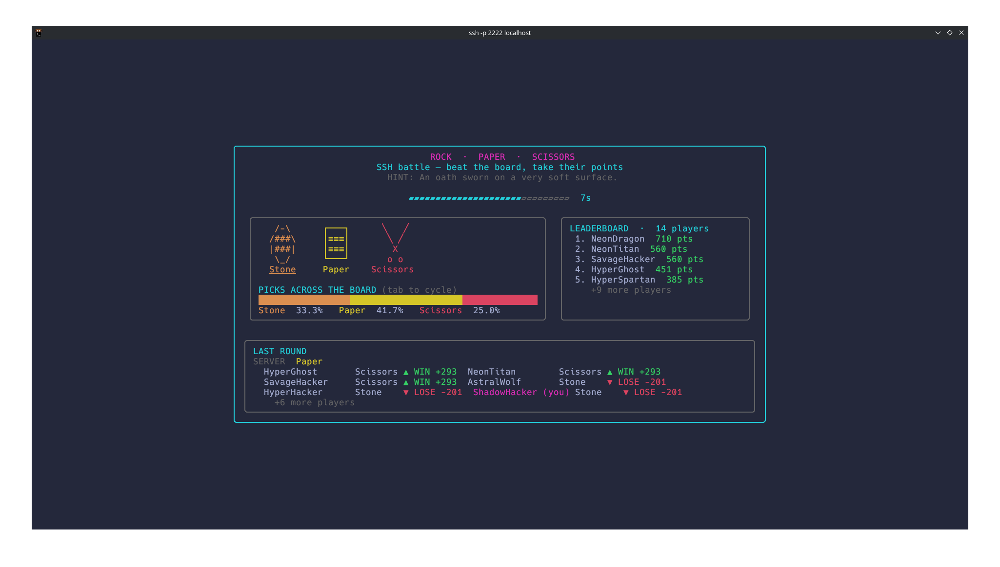

<div align="center">

# Rock · Paper · SSH

**A PvE multiplayer rock-paper-scissors arena that's played entirely over SSH.**  
*No client. No install. No account. Just connect. And play.*

```yaml
ssh rps.bittu.dev -p 2222
```
<br>



<br>

</div>

## How To Play

- Every round opens with a riddle hinting at the server's secret move.
- Win against the server and take **+25 pts**.
- The winning pool is funded by losers, who forfeit **50%** of their points.
- A leaderboard shows the live scores of everyone playing.
- Each round is 10 seconds long, so you need to be quick.


## Controls

- Pick Rock/Paper/Scissors using `tab` or any other key
- `ctrl+c` quit the game.


## 🚀 Run your own

```bash
go run .            # starts on localhost:2222
ssh localhost -p 2222
```

<sub>configurable via `PORT` · `HOST` · `SSH_HOST_KEY_PATH`</sub>

<br>

## 🛠️ Built with

[Wish](https://github.com/charmbracelet/wish) · [Bubble Tea](https://github.com/charmbracelet/bubbletea) · [Lip Gloss](https://github.com/charmbracelet/lipgloss)

<br>

</div>
